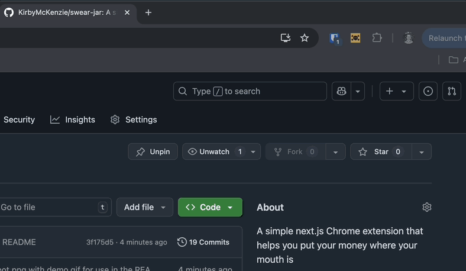

# Swear Jar 💰

A simple Chrome extension that helps you put your money where your mouth is—literally. Every time you let a swear slip, add to your balance and decide where it should go.

## How It Works

Simply open the app and hit the button—that's it.

Swear Jar runs on the honor system. No AI listening in, no automatic charges—just you holding yourself accountable.



### What to Do with Your Balance?

Once you've racked up some fines, it's up to you how to spend them:

- **Donate it** to a charity and turn bad habits into good deeds.
- **Reward yourself**—because progress deserves a treat.
- **Save it** for something meaningful down the line.

## TODO

- [ ] Submit to Chrome Web Store
- [ ] Add TypeScript support
- [ ] Add ability for custom deposit amounts

## Getting Started

Clone the repo and install dependencies:

```sh
yarn install
yarn dev
```

## Build for Chrome

```sh
yarn build # macOS
yarn build:linux # Linux
```
